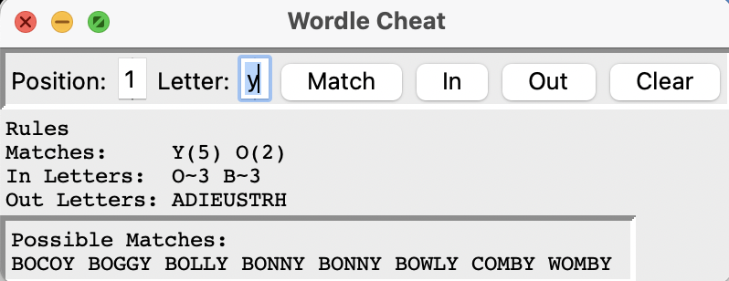

# Wordle Cheat
A utility to assist with completing the [wordle](https://www.nytimes.com/games/wordle/index.html) online game.

As you play the wordle game it tells you if the letter you guessed is:
- A **match** in green (i.e. you guesses the correct letter in the correct positiom)
- A letter **in** the word in orange (i.e. the letter you guessed occurs in the word, but not at the position you chose) 
- Or an **out** letter in black (i.e. the letter you guessed does not occuer in the word)

The way this tool works is that you enter the responses from wordle into the user interface and it lists possible matching words. Initially the list of words will be just a dump of the dictionary, but as you make more guesses it will be a much smaller list.

## Installation and running

Download and install Python from [here](https://www.python.org/downloads/)

Clone this repository with the command 
``
    % git clone https://github.com/bodonovan/wordle_cheat.git
``

Run the utility with the command `% python3 match.py`

What you see is something like

When you make a guess at the Wordle site, type in the letter you guessed and click on the relevant button to say it was a match, in or out character.

In the screenshot of the game you see that Y is definitely correct for position 5 and O is a match for position 2. You also see that B is in the word but not at position 3. Finally you see that none of the letters ADIEUSTRH appear in the word. You see a relatively short list of words that meet this spec.

If you make a mistake there is no way to erase a single error, but clicking on the _clear_ button will reset the game.

## Tactics

A good starting guess is the word _ADIEU_ - it contains 4 of the 5 vowels in the English language. Sometimes the results you get from this guess will narrow down the potential words, but if not you could try _STORY_ - this contains the remaing vowel and several frequently occuring letters.

There is no real guidance for subsequent guesses as such. Normally the Wordle daily words are not too uncommon, so if you are presented with a list of potential words pick one you recognise.

## Known problems

- With python versions prior to 3.12 this program will behave very badly (frequently failing to respond to button clicks). Therefore you are strongly advised to upgrade to at least v3.12.
- The program does not behave totally correctly when the target word contains duplicate letters (i.e. either in the hidden word or in your guess). There are plans to fix this, but it is tricky because I cant easily see how double lettters are scored because wordle rarely has any.

